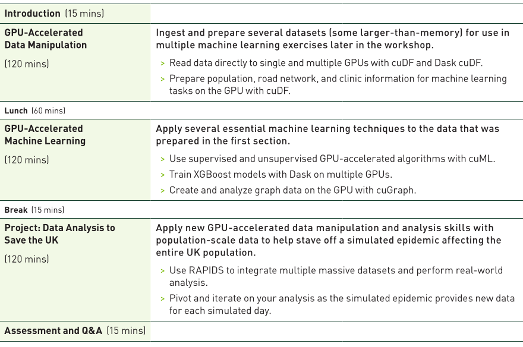
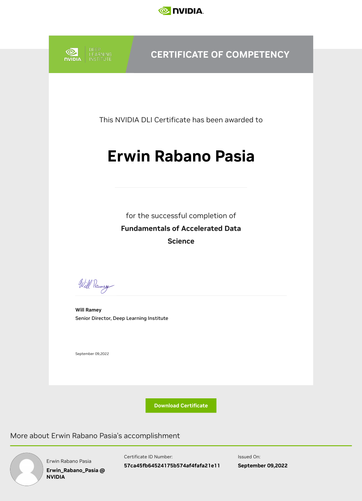

# [NVIDIA DLI - Advanced Technical Workshop: Fundamentals of Accelerated Data Science with RAPIDS](https://learn.nvidia.com/courses/course-detail?course_id=course-v1:DLI+C-DS-02+V2) - COMPLETED!

**Learning Objectives:**

1. Implement GPU-accelerated data preparation and feature extraction using cuDF and Apache Arrow data frames.
2. Apply a broad spectrum of GPU-accelerated machine learning tasks using XGBoost and a variety of cuML algorithms.
3. Execute GPU-accelerated graph analysis with cuGraph, achieving massive-scale analytics in small amounts of time.
4. Rapidly achieve massive-scale graph analytics using cuGraph routines.
5. Finally! Save UK by staving-off a Simulated Epidemic!

# Fundamentals of Accelerated Data Science with RAPIDS

This repository provides an overview of the **Fundamentals of Accelerated Data Science with RAPIDS** course, offered by NVIDIA's Deep Learning Institute (DLI). The course is designed to teach data scientists how to leverage GPU acceleration to significantly speed up their data science workflows using the RAPIDS open-source libraries.

## Overview of RAPIDS

RAPIDS is a suite of open-source software libraries and APIs developed by NVIDIA, built on CUDA, that allows for high-performance GPU-accelerated data science. RAPIDS provides familiar APIs that closely resemble popular Python data science libraries like Pandas and Scikit-learn, making it easier for users to transition from CPU-based workflows to GPU-accelerated ones.

### Key Libraries in RAPIDS:
- **cuDF**: A GPU-accelerated DataFrame library that mimics Pandas, allowing for fast data manipulation and analysis.
- **cuML**: A machine learning library that provides GPU-accelerated implementations of popular ML algorithms like KNN, DBSCAN, logistic regression, and more.
- **cuGraph**: A graph analytics library that accelerates graph-based computations such as shortest path algorithms.

## GPU-Accelerated Data Manipulation with cuDF

One of the major components of the course is learning how to use **cuDF** for data manipulation tasks that would traditionally be done using Pandas. cuDF offers significant performance improvements by offloading computations to the GPU.

### Key Features of cuDF:
- **Zero-code change acceleration**: cuDF can often be used as a drop-in replacement for Pandas without modifying existing code.
- **DataFrame Operations**: Operations like filtering, grouping, merging, and aggregating large datasets are performed much faster compared to CPU-based alternatives.
- **Integration with Dask**: cuDF can work with Dask to scale out workloads across multiple GPUs for even larger datasets.

## GPU-Accelerated Machine Learning with cuML

The course also covers the use of **cuML**, which accelerates traditional machine learning algorithms by running them on GPUs. This allows for faster training times and quicker model iteration cycles.

### Key Algorithms in cuML:
- **K-nearest neighbors (KNN)**: Used for classification and regression tasks.
- **DBSCAN**: A clustering algorithm that benefits from the parallel processing power of GPUs.
- **Logistic Regression**: Commonly used for binary classification tasks.
- **XGBoost**: A popular gradient boosting algorithm that has been optimized for GPUs within the RAPIDS ecosystem.

## Graph Analytics with cuGraph

For users working with graph-based data, RAPIDS offers **cuGraph**, which accelerates graph algorithms using GPUs.

### Key Algorithms in cuGraph:
- **Single-source shortest path (SSSP)**: Computes the shortest path from a source node to all other nodes in a graph.
- **PageRank**: Measures the importance of nodes within a graph based on their connections.

## End-to-End Workflow Acceleration

The course emphasizes building end-to-end workflows where every stage—from data loading and preprocessing to model training and evaluation—is accelerated using GPUs. By integrating RAPIDS libraries like cuDF, cuML, and cuGraph into these workflows, users can achieve significant speedups compared to traditional CPU-based approaches.

### Benefits of End-to-End GPU Acceleration:
- **Faster Iteration Cycles**: By reducing computation time at each stage, users can experiment with more models or parameters in a shorter amount of time.
- **Scalability**: RAPIDS leverages multi-GPU setups through Dask integration, allowing for scalability across large datasets without sacrificing performance.

## Comparison Between CPU vs. GPU Workflows

| Aspect               | CPU Workflow (Traditional)          | GPU Workflow (RAPIDS)                      |
|----------------------|-------------------------------------|--------------------------------------------|
| Data Processing Time | Slower due to sequential execution  | Faster due to parallel processing on GPUs  |
| Model Training Time  | Longer due to limited CPU cores     | Shorter due to massive parallelism on GPUs |
| Scalability          | Limited by CPU resources            | Scalable across multiple GPUs              |
| API Familiarity      | Pandas/Scikit-learn                 | Similar APIs (cuDF/cuML)                   |

## Best Practices for Refactoring CPU Workloads

The course teaches best practices for refactoring existing CPU-based workflows into GPU-based ones:
1. Identify bottlenecks in existing workflows where GPU acceleration would provide the most benefit (e.g., large matrix operations).
2. Utilize RAPIDS' zero-code change features where possible (e.g., replacing Pandas with cuDF).
3. Leverage Dask for distributed computing when working with large datasets or multi-GPU environments.

## Conclusion

By completing this course, participants will gain hands-on experience in building high-performance data science pipelines using NVIDIA's RAPIDS libraries. The knowledge gained will enable them to:
1. Refactor existing CPU-based workflows into faster GPU-based ones.
2. Build new end-to-end accelerated workflows from scratch.
3. Apply advanced machine learning and graph analytics techniques at scale using GPUs.

This course is ideal for intermediate Python users who are familiar with traditional data science workflows but want to explore how GPU acceleration can dramatically improve performance and efficiency in their projects.

## Instructor-Led Workshop Outline:

    

## [Certificate Of Competency:](https://learn.nvidia.com/certificates?id=57ca45fb64524175b574af4fafa21e11)

    

