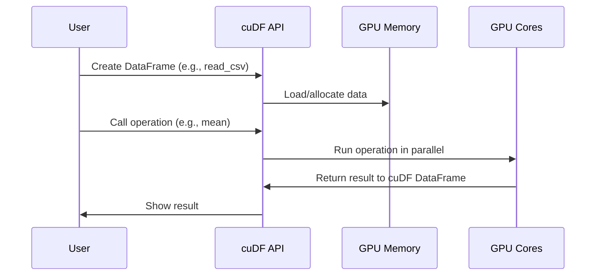

# Chapter 1: cuDF DataFrames

Welcome to your journey into GPU-accelerated data science with RAPIDS! In this first chapter, we'll dive into the heart of tabular data analysis on your GPU: **cuDF DataFrames**.

## Why cuDF? A Simple, Powerful Analogy

Imagine you have a giant spreadsheet with millions of rows—far too big for your laptop to handle comfortably. In traditional data science, you'd use *pandas* to wrangle this data, but it can be slow, especially as your data grows. **cuDF** is like giving pandas a jet engine: it takes your familiar code and makes it super fast by running it on your computer's graphics card (GPU).

**Central Use Case:**  
You want to analyze a massive CSV file with millions of records, finding trends, cleaning up values, and exploring results—all in seconds, not hours.

## What Is a cuDF DataFrame?

A **cuDF DataFrame** is nearly identical in use to a pandas DataFrame; it's a table with rows and columns that you can load, clean, query, and manipulate. The only big difference? cuDF stores and processes your data on the GPU, making operations *blazingly fast*.

- **Columns**: Each holds a single data type (int, float, string, etc.).
- **Rows**: Each is one record or observation.
- **Methods**: Most pandas methods work—like `head()`, `mean()`, `groupby()`—but now they're GPU-powered!

Think of cuDF as a “turbocharged pandas” with nearly the same syntax.

---

## Getting Started with cuDF

Let's see how you can create and use cuDF DataFrames in practice.

**Step 1: Import cuDF**

```python
import cudf  # This brings cuDF into your Python environment
```

**Step 2: Creating DataFrames**

You don’t have to rely only on reading files. Here are several friendly ways to create a cuDF DataFrame[2][5]:

- **From a list:**

    ```python
    import cudf

    df = cudf.DataFrame([1, 2, 3, 4], columns=['numbers'])
    print(df)
    ```
    *Creates a single-column DataFrame named "numbers".*

- **From a dictionary:**

    ```python
    data = {
        'numbers': [1, 2, 3, 4],
        'letters': ['a', 'b', 'c', 'd']
    }
    df = cudf.DataFrame(data)
    print(df)
    ```
    *Easy way to create multiple columns!*

- **From a list of tuples:**

    ```python
    df = cudf.DataFrame([
        (1, 'apple'),
        (2, 'banana')
    ], columns=['id', 'fruit'])
    print(df)
    ```
    *Useful for row-oriented data.*

- **Creating an empty DataFrame and assigning columns:**

    ```python
    df = cudf.DataFrame()
    df['foo'] = [1, 2, 3]
    df['bar'] = ['a', 'b', 'c']
    print(df)
    ```
    *Builds your DataFrame one column at a time!*

**Step 3: Loading Data from Files**

Most real-world work starts with files:

```python
df = cudf.read_csv('my_big_file.csv')
print(df.head())
```
*Loads a CSV file directly into GPU memory for lightning-fast processing!*

---

## Basic Operations: Familiar and Fast

**View the First Few Rows:**

```python
print(df.head())
```

**Check Column Types:**

```python
print(df.dtypes)
```

**Calculate Column Means:**

```python
print(df['numbers'].mean())
```
*Just like pandas, but turbocharged!*

**Add or Modify Columns:**

```python
df['squared'] = df['numbers'] ** 2
print(df)
```

---

## Internal Mechanics: What Happens When You Create a cuDF DataFrame?

Let’s peek under the hood using a simple analogy and a flow diagram.

- When you create or load a DataFrame with cuDF, the data is stored in GPU memory instead of regular RAM.
- Operations (like filtering, math, string processing) are carried out in parallel using thousands of lightweight GPU threads.
- Results stay on the GPU until you explicitly move them back to CPU (for example, using `.to_pandas()`).



*The magic: thousands of GPU cores working at once, instead of just a handful of CPU cores!*

---

## How Is cuDF Implemented? (A Peek at the Source)

cuDF is written mostly in Python and C++. When you call something like `cudf.read_csv()`, here’s what happens in simple terms:

1. **Python API layer**: Receives your request and figures out what you need.  
2. **C++ Core**: Handles the heavy lifting—reading data, storing it in efficient formats, and running computations.
3. **GPU Kernels**: Specialized programs that run on the GPU, doing string manipulation, math, filtering, etc.

For example, when you run:

```python
df = cudf.read_csv('data.csv')
```

- The Python function calls into the C++ backend, which reads the file in big chunks straight into GPU memory (much faster than copying from disk to RAM, then RAM to GPU).
- Internal classes manage your columns and rows, tracking data types for GPU execution.
- Any further operation (`df['col'].mean()`, `df.groupby('label')`, etc.) becomes a GPU-accelerated function call.

**References in the project:**  
- To see this in action, explore files like `1-03_cudf_basics.py` for reading data and performing column operations.
- Grouping and sorting are showcased in `1-04_grouping_sorting.py`.

---

## Converting to and from pandas

Need your data back on the CPU? One line does the trick:

```python
pdf = df.to_pandas()    # Moves data from GPU back to CPU, as a pandas DataFrame
```

Or, you can convert a pandas DataFrame to cuDF:

```python
import pandas as pd
pd_df = pd.read_csv('data.csv')
gdf = cudf.from_pandas(pd_df)
```
*Switch easily between pandas and cuDF as needed!*

---

## Summary and What's Next

By now, you’ve learned:

- What cuDF DataFrames are and why they're a game-changer for big data.
- How to create, explore, and manipulate them in familiar, pandas-like ways.
- That cuDF brings “turbocharged” speed by harnessing your GPU.

In the next chapter, we'll explore how to accelerate array operations using another GPU-powered library, [CuPy for GPU-Accelerated Array Operations](02_cupy_for_gpu_accelerated_array_operations_.md).

Get ready to supercharge your numerical workflows!

---

Generated by [Erwin R. Pasia](https://github.com/erwinpasia/Full-Stack-Data-Science)
