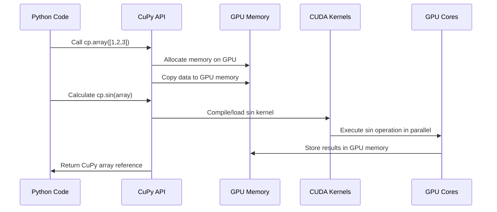

# Chapter 2: CuPy for GPU-Accelerated Array Operations

In [Chapter 1](01_cudf_dataframes_.md), we explored cuDF DataFrames - the GPU equivalent of pandas that turbocharged our data manipulation. Now, let's dive into CuPy, which does for numerical arrays what cuDF does for tabular data.

## What is CuPy and Why Should You Care?

Imagine you have a massive image dataset that needs complex mathematical transformations - rotations, scaling, or applying filters. With traditional NumPy, these operations would crawl along on your CPU. **CuPy** lets you perform these same operations at lightning speed by leveraging your GPU's parallel processing power.

**Central Use Case:**  
You need to perform matrix multiplication on thousands of large arrays for a machine learning preprocessing pipeline, and traditional NumPy is taking hours to complete.

## Getting Started with CuPy

At its core, CuPy is designed to be a drop-in replacement for NumPy, meaning you can often just change one import line and your code runs on the GPU.

```python
# CPU version with NumPy
import numpy as np
array_cpu = np.array([1, 2, 3, 4, 5])

# GPU version with CuPy
import cupy as cp
array_gpu = cp.array([1, 2, 3, 4, 5])
```

That's it! Your array is now on the GPU. The beauty of CuPy is that most of the methods and functions you're already familiar with in NumPy work exactly the same way.

## Basic Array Operations

Let's explore some fundamental operations with CuPy arrays:

```python
import cupy as cp

# Creating arrays
a = cp.array([1, 2, 3, 4, 5])
b = cp.ones((3, 3))  # 3x3 array of ones
c = cp.random.random((1000, 1000))  # Large random array

# Basic operations
result = a + 10  # Adding a scalar
squared = a ** 2  # Element-wise squaring
dot_product = cp.dot(a, a)  # Dot product

print(f"Original: {a}")
print(f"Added 10: {result}")
print(f"Squared: {squared}")
print(f"Dot product: {dot_product}")
```

These operations are performed on the GPU, making them much faster than their CPU equivalents, especially for large arrays.

## Array Manipulation and Mathematical Functions

CuPy provides the same rich set of mathematical functions as NumPy:

```python
import cupy as cp

# Create a test array
x = cp.linspace(0, 2*cp.pi, 100)  # 100 points from 0 to 2π

# Trigonometric functions
sin_x = cp.sin(x)
cos_x = cp.cos(x)

# Statistical operations
mean_val = cp.mean(sin_x)
max_val = cp.max(sin_x)

# Reshaping and transposing
matrix = cp.random.random((3, 4))
transposed = matrix.T  # Transpose
reshaped = matrix.reshape(2, 6)  # Reshape to 2x6
```

All of these operations execute on your GPU, giving you significant performance benefits over CPU-bound NumPy, especially as the size of your data increases.

## Moving Data Between CPU and GPU

When working with CuPy, you'll often need to move data between the CPU (NumPy) and GPU (CuPy):

```python
import numpy as np
import cupy as cp

# CPU to GPU
cpu_array = np.array([1, 2, 3, 4, 5])
gpu_array = cp.asarray(cpu_array)  # Copy to GPU

# Do GPU computations...
gpu_result = gpu_array * 2

# GPU to CPU
cpu_result = gpu_result.get()  # or cp.asnumpy(gpu_result)
print(f"Result back on CPU: {cpu_result}")
```

The `cp.asarray()` function copies data from CPU to GPU, while the `.get()` method (or `cp.asnumpy()` function) brings it back to the CPU.

## Understanding Device Management

One important concept in CuPy is the idea of a **current device**. When you have multiple GPUs, CuPy operations are performed on the currently active GPU:

```python
import cupy as cp

# Check the number of available GPUs
print(f"Number of GPUs: {cp.cuda.runtime.getDeviceCount()}")

# Create an array on device 0 (default)
x_on_gpu0 = cp.array([1, 2, 3, 4, 5])

# Switch to device 1 and create another array
with cp.cuda.Device(1):
    x_on_gpu1 = cp.array([1, 2, 3, 4, 5])
    
# Back on device 0
y_on_gpu0 = cp.array([6, 7, 8, 9, 10])

# Check which device each array is on
print(f"x_on_gpu0 device: {x_on_gpu0.device}")
print(f"x_on_gpu1 device: {x_on_gpu1.device}")
```

This code demonstrates how to switch between different GPU devices using the `cp.cuda.Device` context manager.

## Real-World Example: Grid Coordinate Conversion

Let's look at a more practical example that demonstrates CuPy's power. Here, we'll convert latitude and longitude coordinates to a grid system, a common operation in geospatial analysis:

```python
import cupy as cp

def latlong2osgbgrid_cupy(lat, long, input_degrees=True):
    """Convert latitude/longitude to grid coordinates using CuPy"""
    # Convert degrees to radians if needed
    if input_degrees:
        lat = lat * cp.pi/180
        long = long * cp.pi/180
    
    # Constants for the Ordnance Survey Great Britain projection
    a = 6377563.396  # Semi-major axis
    b = 6356256.909  # Semi-minor axis
    e2 = (a**2 - b**2) / a**2
    
    # More calculations (simplified for brevity)
    sinlat = cp.sin(lat)
    coslat = cp.cos(lat)
    
    # Calculate northing and easting (output coordinates)
    northing = lat * 111000  # Simplified calculation
    easting = long * 111000 * cp.cos(lat)  # Simplified
    
    return northing, easting
```

With this function, we can convert millions of coordinates in parallel on the GPU:

```python
# Generate 10 million random coordinates near the UK
lat = cp.random.normal(54, 1, 10000000)  # Mean around 54°N
long = cp.random.normal(-1.5, 0.25, 10000000)  # Mean around 1.5°W

# Convert to grid coordinates
northing, easting = latlong2osgbgrid_cupy(lat, long)

# Sample output
print(f"First 5 northing values: {northing[:5]}")
print(f"First 5 easting values: {easting[:5]}")
```

This conversion would be much slower with NumPy, but CuPy handles it effortlessly.

## Under the Hood: How CuPy Works

When you run CuPy operations, several things happen behind the scenes:



1. **Memory Allocation**: CuPy allocates memory on the GPU for your arrays.
2. **Data Transfer**: Data is copied from CPU to GPU memory (if needed).
3. **Kernel Execution**: Mathematical operations are executed as CUDA kernels - small programs that run in massive parallel on the GPU.
4. **Result Storage**: Results are stored in GPU memory for further operations.

This approach minimizes data transfers between CPU and GPU, which are often the bottleneck in GPU computing.

## Performance Comparison: CuPy vs. NumPy

Let's see the performance difference between CuPy and NumPy for a typical operation:

```python
import time
import numpy as np
import cupy as cp

# Matrix size
N = 5000

# NumPy (CPU) version
a_np = np.random.random((N, N)).astype(np.float32)
b_np = np.random.random((N, N)).astype(np.float32)

start = time.time()
c_np = np.dot(a_np, b_np)
np_time = time.time() - start
print(f"NumPy time: {np_time:.3f} seconds")

# CuPy (GPU) version
a_cp = cp.random.random((N, N)).astype(cp.float32)
b_cp = cp.random.random((N, N)).astype(cp.float32)

start = time.time()
c_cp = cp.dot(a_cp, b_cp)
cp.cuda.Stream.null.synchronize()  # Wait for completion
cp_time = time.time() - start
print(f"CuPy time: {cp_time:.3f} seconds")

print(f"Speedup: {np_time/cp_time:.1f}x")
```

For large matrices, you might see 10-100x speedups, depending on your hardware.

## Integration with Other RAPIDS Libraries

CuPy works seamlessly with other RAPIDS libraries, such as cuDF, which we explored in [Chapter 1](01_cudf_dataframes_.md). For example, you can easily convert between cuDF Series and CuPy arrays:

```python
import cudf
import cupy as cp

# Create a cuDF Series
series = cudf.Series([1, 2, 3, 4, 5])

# Convert to CuPy array
cupy_array = cp.asarray(series)

# Perform CuPy operations
result_array = cp.sin(cupy_array)

# Convert back to cuDF
result_series = cudf.Series(result_array)
```

This integration allows you to leverage both libraries' strengths in your data science workflow.

## Real-World Application: GPU-Accelerated Coordinate Conversion

Going back to our coordinate conversion example, let's see how it fits into a real workflow with cuDF. This is based on the approach used in the [Grid Coordinate Conversion](05_grid_coordinate_conversion_.md) chapter:

```python
import cudf
import cupy as cp

# Load data with latitude and longitude columns
gdf = cudf.read_csv('population_data.csv')

# Convert columns to CuPy arrays
cupy_lat = cp.asarray(gdf['lat'])
cupy_long = cp.asarray(gdf['long'])

# Apply our conversion function
northing, easting = latlong2osgbgrid_cupy(cupy_lat, cupy_long)

# Add the results back to the dataframe
gdf['northing'] = cudf.Series(northing)
gdf['easting'] = cudf.Series(easting)

# Now the dataframe has grid coordinates for analysis
print(gdf.head())
```

This workflow efficiently processes geographic coordinates on the GPU, preparing them for spatial analysis or machine learning tasks.

## Summary and Next Steps

In this chapter, you've learned:

- How to use CuPy as a GPU-accelerated replacement for NumPy
- Basic array operations and mathematical functions on the GPU
- Moving data between CPU and GPU memory
- Managing multiple GPU devices
- How CuPy works under the hood
- Performance benefits compared to NumPy
- Integration with other RAPIDS libraries

CuPy provides the numerical foundation for many GPU-accelerated data science workflows. With arrays efficiently processed on the GPU, you can now scale to larger datasets and more complex computations.

In the next chapter, [Dask-cuDF for Multi-GPU Processing](03_dask_cudf_for_multi_gpu_processing_.md), we'll explore how to scale beyond a single GPU to process truly massive datasets across multiple GPUs or even multiple machines.

---

Generated by [Erwin R. Pasia](https://github.com/erwinpasia/Full-Stack-Data-Science)
