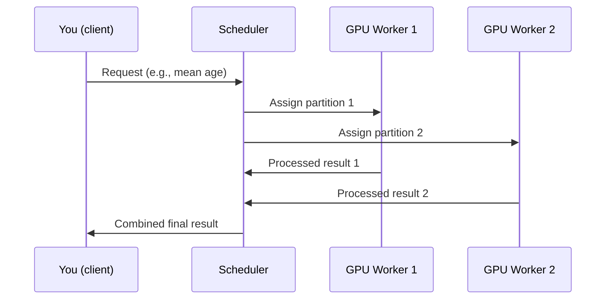

# Chapter 3: Dask-cuDF for Multi-GPU Processing

Welcome to Chapter 3!  
In [the last chapter](02_cupy_for_gpu_accelerated_array_operations_.md), you learned how to use CuPy to accelerate array operations on a single GPU. Now, let's scale our superpowers: what if you have **datasets too big for one GPU**—or simply want to crunch numbers *even faster* by using all the GPUs in your system?  
This is where **Dask-cuDF** comes in.

---

## Why Dask-cuDF? A Friendly Motivation

**Central Use Case:**  
Imagine you have a humongous CSV file—so large that it won’t fit on a single GPU. You want to:
- Load, clean, and analyze it quickly
- Use *every* GPU in your server (or even across several servers)
- Write code that looks just like the pandas you know

**Dask-cuDF lets you do this by splitting your data and work across all available GPUs—like a manager assigning tasks to a team of skilled assistants, each working on a slice of your dataset in parallel**[1][2][3][5].

---

## What Is Dask-cuDF? The Elevator Pitch

- **Dask** is a library for scaling pandas/NumPy workloads across multiple CPUs or machines.
- **cuDF** (from [Chapter 1](01_cudf_dataframes_.md)) turbocharges pandas with a single GPU.
- **Dask-cuDF** combines both: it lets you process huge data as *many* cuDF DataFrames—one per GPU or worker—coordinated automatically[1][2][3][4][5].

**Analogy:**  
It's like dividing a 1,000-page book among four friends (GPUs), letting each summarize a section, then collecting their work for the final report.

---

## Key Concepts, Step by Step

### 1. Partitioning Data with Dask-cuDF

- **Partition** = a slice of your data assigned to a single GPU.
- **Dask-cuDF DataFrame** is made up of many partitions.
- Each partition is a cuDF DataFrame, living on a single GPU.

**Why split data?**  
- Each GPU gets its share—so you can handle data *way* bigger than any single GPU's memory.

### 2. The Dask Scheduler and Workers

- **Scheduler:** The "boss"—knows the plan, assigns tasks, distributes data[2].
- **Workers:** The "helpers"—each running on a GPU, crunching numbers, reporting results.

**How it works:**  
- The scheduler breaks your job into smaller tasks.
- Each worker gets a task and runs it on its own GPU.
- Results are collected back when done.

### 3. Setting Up a Multi-GPU Cluster

You'll use a **LocalCUDACluster** (explained more in [the next chapter](04_localcudacluster_for_gpu_resource_management_.md)) to launch a Dask cluster, one worker per GPU[2][5].

---

## Solving Our Use Case: Sample Code Walkthrough

Let’s go from **zero** to **multi-GPU** in just a few lines!

### Step 1: Start a Dask Cluster

```python
from dask_cuda import LocalCUDACluster
from dask.distributed import Client

cluster = LocalCUDACluster()
client = Client(cluster)
```

*You now have a "manager" (scheduler) and "workers" (one per GPU) ready to go!*

### Step 2: Load Data with Dask-cuDF

```python
import dask_cudf

# Reads and splits data across GPUs automatically!
ddf = dask_cudf.read_csv('huge_file.csv')
```

**What's happening?**  
- Each GPU parses a chunk of the CSV in parallel[1][2][3].

### Step 3: Manipulate Data

You use Dask-cuDF DataFrames just like pandas or cuDF—but *under the hood* it's parallelized:

```python
# Compute average age across all data
mean_age = ddf['age'].mean()
print(mean_age.compute())  # .compute() triggers actual computation
```

*The manager assigns parts of the work to each worker, who process their partition and combine results.*

**Other common operations:**  
- `ddf.head()`: See the first few rows
- `ddf.groupby('city').sum()`
- `ddf['score'] = ddf['score'] * 2`

All split and done in parallel!

### Step 4: Persist Data for Fast Reuse

After loading and processing, you can **persist** the data to keep it in fast GPU memory:

```python
ddf = ddf.persist()
```

---

## Inputs and Outputs: What to Expect

- **Input:** A huge file (e.g., `huge_file.csv`)
- **Output:** Results come back to you (the driver) as regular numbers or small DataFrames.

Example:

```python
count = ddf['city'].nunique().compute()
print("Unique cities:", count)
```

*You ask Dask-cuDF a question (like "How many cities?"), and the answer comes back when all GPUs are done with their piece.*

---

## Under the Hood: What Actually Happens?

Let’s peek inside, step-by-step, using both a story and a diagram.

### The Analogy: Book Summarizing

1. The manager (scheduler) receives your request.
2. He splits the book (data) into sections.
3. Each assistant (GPU worker) gets a section.
4. Assistants summarize their part at the same time (in parallel).
5. The manager collects all summaries, combines them, and hands you the final report.

### Sequence Diagram



---

## How Is Dask-cuDF Implemented? (Internal Mechanics)

- When you call something like `dask_cudf.read_csv()`, each worker on a GPU:
    - Executes cuDF code (`cudf.read_csv()`)—same fast parsing as [Chapter 1](01_cudf_dataframes_.md)[1].
    - The Dask scheduler manages who does what.
- All other DataFrame operations (`mean()`, `groupby()`, etc.) become **tasks** to be scheduled and computed in parallel[1][2][3].

**Reference:**
- Code examples: See `1-07_dask-cudf.py` for Dask-cuDF basics and `2-07_kmeans_dask.py` for using Dask with machine learning.
- Custom function mapping: See how `map_partitions` is used to apply your own function to every partition.
- Dashboard: The Dask dashboard (usually at port 8787) lets you watch all this happen live.

---

## Best Practices & Tips

- **When to use Dask-cuDF:**  
  - Your data is too big for a single GPU
  - You have multiple GPUs (or machines)
  - You want faster results by parallel processing[1][4][5]

- **Stick with cuDF** if you have a single GPU and data fits comfortably[1].

- **Switching between CPU and GPU:**  
  Dask supports "backend" configuration—so you can swap between pandas (CPU) and cuDF (GPU) easily in code[4]:

    ```python
    import dask
    dask.config.set({"dataframe.backend": "cudf"})
    # or for CPU: dask.config.set({"dataframe.backend": "pandas"})
    ```

---

## Recap: What Have You Learned?

- **Dask-cuDF** is your engine for scaling tabular data work across *multiple* GPUs.
- It splits data across GPUs, does the work in parallel, and combines results seamlessly.
- Most of your code will look and feel just like pandas or cuDF—just *way* more powerful.

---

**Next Steps:**  
Ready to see how you can manage your GPU resources smartly?  
Continue to [LocalCUDACluster for GPU Resource Management](04_localcudacluster_for_gpu_resource_management_.md).

---

Generated by [Erwin R. Pasia](https://github.com/erwinpasia/Full-Stack-Data-Science)
