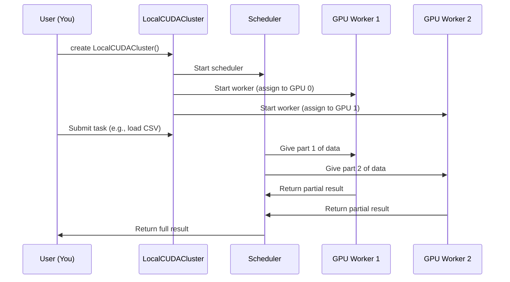

# Chapter 4: LocalCUDACluster for GPU Resource Management

In [Chapter 3: Dask-cuDF for Multi-GPU Processing](03_dask_cudf_for_multi_gpu_processing_.md), you learned how Dask-cuDF splits large datasets and computations across multiple GPUs, making it possible to process data much larger than a single GPU’s memory.  
But this raises a big question: **How do you actually organize and manage all those GPUs so they work together smoothly—and don’t interfere with each other?**

Welcome to LocalCUDACluster—the office manager for your GPUs!

---

## Why Do You Need LocalCUDACluster?

**Central Use Case:**  
You have a workstation with several GPUs, and you want to process a giant dataset as quickly as possible.  
You need each GPU to work on a chunk of the data, but they must not “fight” over resources or overload their memory.  
You want an easy way to:

- Automatically assign work to each GPU
- Track what each GPU is doing
- Visualize progress and memory usage
- Avoid messy configuration and manual task assignment

**LocalCUDACluster** is your solution—it manages your GPUs for distributed workloads with Dask, so you can focus on data science, not hardware babysitting[4][5].

---

## What Is LocalCUDACluster? (Beginner Analogy)

Imagine your GPUs are employees in an office.  
**LocalCUDACluster** acts as their supervisor:

- It divides up the work and hands each GPU a stack of papers (tasks)
- Makes sure nobody gets overloaded
- Tracks who’s working on what
- Handles communication between them
- Reports overall progress on a big dashboard

All you have to do is say, “Here’s the project—assign it to everyone and tell me when it’s done!”

---

## Key Concepts, Explained Simply

**1. Worker and Scheduler**

- The **scheduler** is the “boss”—it knows the big picture.
- Each **worker** is one GPU handling a part of the job.

**2. GPU Pinning**

- Each worker is pinned (assigned) to a specific GPU, so there’s no confusion or overlap[4].
- This prevents two processes from accidentally using the same GPU or hogging memory.

**3. Memory Management**

- You can set memory limits for each GPU to avoid running out of memory (OOM errors).  
- If a worker needs more memory than is available, Dask can automatically “spill” data from GPU to CPU memory as backup[5].

**4. Dashboard**

- LocalCUDACluster comes with a real-time dashboard.  
- See GPU utilization, memory usage, and progress, live in your browser[4].

---

## Getting Started: Minimal Example

Let’s walk through setting up a LocalCUDACluster step-by-step.

**Step 1: Import and Create a Cluster**

```python
from dask_cuda import LocalCUDACluster
from dask.distributed import Client

cluster = LocalCUDACluster()
client = Client(cluster)
```

**What happens here?**

- `LocalCUDACluster()` finds all GPUs on your machine and creates one worker for each.
- `Client(cluster)` connects your program to the cluster so you can send distributed tasks.

**Step 2: Load and Process Data**

(See [Dask-cuDF](03_dask_cudf_for_multi_gpu_processing_.md) for full workflow.)

```python
import dask_cudf

ddf = dask_cudf.read_csv('bigdata.csv')
result = ddf['value'].mean().compute()
```

- Your CSV is read in parallel—each worker (GPU) gets a chunk to process.
- The final result is combined and returned to you.

**Optional: Custom GPU Memory Limit and Advanced Features**

```python
cluster = LocalCUDACluster(device_memory_limit='10GB', jit_unspill=True)
client = Client(cluster)
```
- `device_memory_limit` sets max memory per GPU for safety.
- `jit_unspill=True` lets Dask automatically offload data to CPU if a GPU is full[5].

---

## Inputs and Outputs: What to Expect

- **Input:** Your code (plus large file) and number of GPUs.
- **Output:**  
  - Data is split, processed in parallel, and recombined.
  - Dashboard shows live status for all GPUs.

**Example Output:**

```
Connected to cluster with 4 GPUs
Mean value: 42.7
(See http://localhost:8787 for dashboard)
```

You can literally watch each GPU’s memory and task list as your job runs!

---

## How Does LocalCUDACluster Work Under the Hood?

Let’s see what happens behind the scenes when you launch a LocalCUDACluster:



- Each GPU gets a dedicated worker with its own memory space.
- The scheduler keeps track of tasks and data locations.
- GPU workers only see the data they’re assigned, minimizing conflicts.

---

## Code Walkthrough: Real Example

**From the FADS_RAPIDS project notebooks:**  
See [1-07_dask-cudf.py] and [2-07_kmeans_dask.py] for usage.

**Snippet 1: Cluster Setup**

```python
from dask_cuda import LocalCUDACluster
from dask.distributed import Client

cluster = LocalCUDACluster()
client = Client(cluster)
```

*This sets up the cluster and client, just as above.*

**Snippet 2: Data Loading and Processing**

```python
import dask_cudf

ddf = dask_cudf.read_csv('huge_file.csv')
ddf = ddf.persist()  # Keeps data in GPU memory
result = ddf['age'].mean().compute()
```

- After `persist()`, each GPU stores its chunk of the data for fast reuse.
- `compute()` triggers all GPUs to process their chunk and combine results.

**Snippet 3: Using Dashboard**

- Visit `http://localhost:8787` (or your node’s IP:8787) in a browser.
- Watch GPU usage, memory, current tasks, and see if any GPU gets overloaded[2][4].

---

## Tips and Best Practices

- **Always use LocalCUDACluster** when working with multiple GPUs on a single machine—don’t try to manually manage GPU devices![4][5]
- **Monitor the dashboard** to spot bottlenecks or memory issues early[4].
- **Set memory limits** if you worry about running out of GPU memory—use `device_memory_limit`[5].
- **Let Dask “spill” to CPU** if GPUs have less memory than your data—use `jit_unspill=True`[5].

---

## Summary and Next Steps

Congratulations! You now know how **LocalCUDACluster** manages your GPUs, making multi-GPU analytics as easy as single-GPU workflows.  
Key takeaways:

- LocalCUDACluster launches and manages one worker per GPU, handling memory and task assignment.
- It integrates seamlessly with Dask-cuDF and all RAPIDS tools.
- The dashboard lets you visually monitor resource usage and computation progress in real time.

**Next up:**  
You’ll apply these concepts to large-scale coordinate conversion and more, in [Grid Coordinate Conversion](05_grid_coordinate_conversion_.md).

---

Generated by [Erwin R. Pasia](https://github.com/erwinpasia/Full-Stack-Data-Science)
