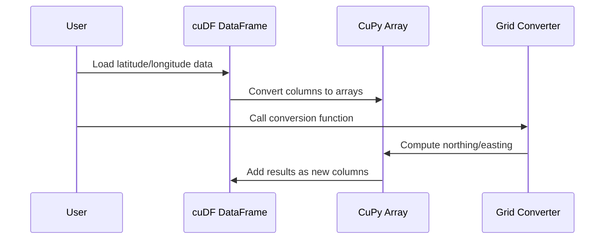

# Chapter 5: Grid Coordinate Conversion

Welcome to Chapter 5!  
In the previous chapter, you learned how to coordinate multi-GPU workloads with [LocalCUDACluster for GPU Resource Management](04_localcudacluster_for_gpu_resource_management_.md). Now, let's zoom in—literally! We'll see how to turn latitude and longitude into a local grid system, making spatial analysis much more accurate and efficient.

## Why Grid Coordinate Conversion?

Imagine you have location data for thousands of people and medical facilities, each point marked by latitude and longitude—like global street addresses. But when you want to answer questions such as "Which hospital is closest to this patient?" or "How far apart are these two clusters of infected people?", lat/lon coordinates alone aren't ideal. Calculating distances on a globe is tricky—like using a world map to find the nearest pizza place!

**Central Use Case:**  
*Find the closest hospital or clinic to every infected person in your city, quickly and with high accuracy.*

To do that, you'll need to convert each global position (lat/lon) into a local grid—imagine city block numbers—so you can measure straight-line distances in meters, not confusing curves over the Earth's surface.

---

## What Is Grid Coordinate Conversion?

**Grid coordinate conversion** transforms latitude and longitude into a flat, local coordinate system. For example, in the UK, it's common to use the Ordnance Survey National Grid, which gives every location a unique "northing" (Y) and "easting" (X) measured in meters from a fixed corner of the country.

**Analogy:**  
- *Latitude/Longitude* = Global address (e.g., "123 Main St, Earth")
- *Grid coordinates* = Local street/block number (e.g., "Block 120, Row 450")

This makes local distances super easy to calculate—just like measuring with a ruler on a city map!

---

## Key Concepts

Let's break down what happens in grid coordinate conversion:

- **Input:** Pairs of latitude and longitude values, usually in degrees.
- **Transformation:** A formula (called a *map projection*) converts these to X (easting) and Y (northing) in meters.
- **Output:** Grid coordinates—perfect for fast, accurate distance calculations.

**Why not just use lat/lon?**  
Straight-line (Euclidean) distance calculations using lat/lon are inaccurate across large areas due to Earth's curvature. But on a projected grid, Pythagoras’ theorem works perfectly for local distances!

---

## Using Grid Coordinate Conversion in Practice

Let's walk through the process with a concrete, beginner-friendly example.

### 1. Converting a Single Pair

Suppose you have a point with:

- Latitude: 51.5 (London, UK)
- Longitude: -0.1

You want to know its grid coordinates. Here's a minimal function (based on the project code):

```python
import cupy as cp

def latlong2osgbgrid_cupy(lat, long, input_degrees=True):
    if input_degrees:
        lat = lat * cp.pi/180
        long = long * cp.pi/180
    # -- Details skipped: see full code in project for all math --
    # This uses Ordnance Survey's Transverse Mercator projection
    # ...
    northing = ... # calculated from lat/long
    easting = ...  # calculated from lat/long
    return northing, easting
```

When you plug in the numbers, you get back two values:  
- **Northing:** Y coordinate in meters  
- **Easting:** X coordinate in meters

*You now have a position on a local map you can use for fast distance calculations!*

### 2. Converting Many Rows Efficiently

To handle thousands or millions of points, use vectorized operations on your GPU:

```python
import cudf
import cupy as cp

# Load data into GPU DataFrame
gdf = cudf.read_csv('data.csv')  # columns 'lat', 'long'

# Convert columns to CuPy arrays
lat = cp.asarray(gdf['lat'])
long = cp.asarray(gdf['long'])

# Compute grid coordinates for all rows at once!
northing, easting = latlong2osgbgrid_cupy(lat, long)

# Add results back to your dataframe
gdf['northing'] = northing
gdf['easting'] = easting
```

**Result:**  
Your GPU-accelerated DataFrame now includes true X and Y grid coordinates for every row.

---

### Example Input and Output

**Input:**  
A table of latitude and longitude values:

| lat      | long    |
|----------|---------|
| 51.5     | -0.1    |
| 53.4     | -2.2    |

**Output:**  
The same table, now with `northing` and `easting` columns (in meters):

| lat      | long    | northing | easting |
|----------|---------|----------|---------|
| 51.5     | -0.1    | 180432   | 530964  |
| 53.4     | -2.2    | 384841   | 436245  |

*Now, you can measure distances using these grid coordinates, just like plotting points on squared graph paper!*

---

## How Does Grid Coordinate Conversion Work Under the Hood?

Here’s how the abstraction works, step by step:



- *You* load your data and convert columns to GPU arrays.
- The *converter function* transforms lat/lon to grid coordinates.
- The GPU efficiently processes all conversions in parallel.
- Resulting columns are added back, ready for distance-based analysis and machine learning.

---

## Internal Implementation: File References and Examples

Behind the scenes, the actual transformation uses a specialized mathematical formula called the *Transverse Mercator projection*, adapted for Great Britain (OSGB36). This can look intimidating, but you don’t need to change it—just call the provided function!

**Core implementation:**  
- See `latlong2osgbgrid_cupy` in files like `1-05_grid_converter.py` and `3-02_find_infected.py`.

**Example usage from the project:**

```python
# Convert lat/lon to grid coordinate arrays
cupy_lat = cp.asarray(gdf['lat'])
cupy_long = cp.asarray(gdf['long'])
northing, easting = latlong2osgbgrid_cupy(cupy_lat, cupy_long)
gdf['northing'] = northing
gdf['easting'] = easting
```

And for Dask-cuDF (multi-GPU/distributed), use `map_partitions` to apply the function to each chunk of your data:

```python
# Dask-cuDF distributed conversion
ddf = dask_cudf.read_csv('big.csv')
result = ddf.map_partitions(latlong2osgbgrid_dask)
```

---

## Summary

- **Grid coordinate conversion** turns global lat/lon into local X/Y coordinates.
- This makes distance calculations fast, accurate, and easy—perfect for spatial clustering, nearest-neighbor search, and mapping.
- The process leverages your GPU for massive parallel speed-ups.
- Provided functions handle the math for you—just plug in your data!

Ready to use your new grid coordinates for machine learning? In the next chapter, you'll discover how to run lightning-fast spatial analytics with [cuML: GPU-Accelerated Machine Learning](06_cuml__gpu_accelerated_machine_learning_.md).

---

Continue to [cuML: GPU-Accelerated Machine Learning](06_cuml__gpu_accelerated_machine_learning_.md) to see your grid data in action!

---

Generated by [Erwin R. Pasia](https://github.com/erwinpasia/Full-Stack-Data-Science)
