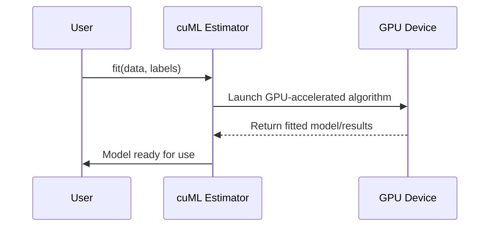

# Chapter 6: cuML – GPU-Accelerated Machine Learning

Welcome back! In [Grid Coordinate Conversion](05_grid_coordinate_conversion_.md), you learned how to transform geographic coordinates into a local grid for faster analytics. Now, let's harness that structured data—and the full power of your GPU—for real machine learning, using **cuML**.

---

## Why cuML? Speeding Up Machine Learning with Your GPU

Imagine you want to quickly find patterns (like clusters of similar patients or predict infection risk) in a huge dataset—millions of rows, dozens of features. On your laptop or server, *scikit-learn* can do the job, but it may take forever as it relies on your CPU.  

**cuML** is like giving machine learning a rocket:  
- It runs familiar algorithms on your GPU—taking tasks that might take minutes (or hours!) and crunching them in seconds.
- The code you write looks almost identical to scikit-learn, so you **don't have to learn a new language**[2][4][5].

**Central Use Case:**  
You want to cluster tens of thousands of locations (from our population grid) in seconds, not minutes, to find optimal supply depot locations or infection hot-spots.

---

## Key Concepts: What cuML Offers

Let's demystify the essentials:

- **scikit-learn Compatibility:** cuML's API mirrors scikit-learn, so switching is easy.
- **GPU Acceleration:** It leverages your NVIDIA GPU for 10–50x speedups over CPU methods[2][4][5].
- **Broad Algorithm Support:** Includes KMeans, DBSCAN, Logistic Regression, Random Forest, and more[2].
- **Seamless Integration:** Works with [cuDF DataFrames](01_cudf_dataframes_.md) for fast, GPU-native data handling.

---

## The Beginner Workflow: Machine Learning at Lightning Speed

Let's solve a simple problem: **Cluster population locations using KMeans**.

### Step 1: Prepare Data (Review)

In earlier chapters, you loaded and converted data. Here's a quick refresher, assuming you have grid coordinates:

```python
import cudf

# Load population data with 'easting' and 'northing' columns (in meters)
gdf = cudf.read_csv('data/population.csv')
```

Your `gdf` will look like:

| easting | northing |
|---------|----------|
| 530964  | 180432   |
| 436245  | 384841   |

*This puts your locations in a format that cuML understands!*

---

### Step 2: Run KMeans Clustering with cuML

```python
import cuml

# Initialize KMeans, requesting 5 clusters
kmeans = cuml.KMeans(n_clusters=5)

# Fit to location data on the GPU!
kmeans.fit(gdf[['easting', 'northing']])
```

**What just happened?**  
You clustered all your points into 5 groups—on the GPU—for maximum speed. This might be 10–50× faster than scikit-learn[2][4][5].

---

### Step 3: Analyze Results

You can inspect the found cluster centers and assign labels to each data point:

```python
# Add cluster labels to your DataFrame
gdf['cluster'] = kmeans.labels_

# Get the coordinates of cluster centers
centers = kmeans.cluster_centers_
print(centers)
```

**Output:**  
- Each row in `gdf` is now labeled with a cluster number.
- `centers` gives the (easting, northing) of each cluster—ideal for plotting/map analysis.

---

## Other Algorithms: Same API, GPU Speed

Want to run *logistic regression* to predict infection, or *nearest neighbors* for hospital routing? Just swap the estimator!

```python
# Logistic Regression
logreg = cuml.LogisticRegression()
logreg.fit(gdf[['age', 'sex']], gdf['infected'])

# Predict infection probabilities:
probs = logreg.predict_proba(gdf[['age', 'sex']])
```

*The pattern is always: initialize → fit → predict—just like scikit-learn, always GPU-powered!*

---

### Quick Comparison: cuML vs. scikit-learn

| Feature             | cuML                         | scikit-learn            |
|---------------------|------------------------------|-------------------------|
| Speed (big data)    | 10–50x faster (on GPU)[2][4] | CPU only (slower)       |
| API Familiarity     | Nearly identical             | Standard                |
| Data Format         | cuDF DataFrames              | pandas DataFrames       |
| Model Support       | Wide & growing[2]            | Very broad              |

---

## How cuML Works Under the Hood

Let's peek at what happens when you call `kmeans.fit` or `logreg.fit`:



- **You** provide the data and algorithm.
- **cuML** launches many parallel GPU threads to process data at high speed.
- **GPU** does the math, cuML gives you the results—just like scikit-learn, but *supercharged*.

---

## Internals: Code and Project Files

When you run something like:

```python
from cuml import KMeans
km = KMeans(n_clusters=5)
km.fit(gdf)
```

Here's what's happening:

- The Python class wraps C++/CUDA compute kernels—no CUDA coding required for you[4][5].
- Data stays on the GPU in [cuDF DataFrames](01_cudf_dataframes_.md), avoiding slow transfers.
- cuML code examples live in files like:
    - `2-03_k-means.py` for KMeans clustering
    - `2-05_logistic_regression.py` for Logistic Regression
    - `2-06_knn.py` for k-nearest-neighbors
    - `2-04_DBSCAN.py` for DBSCAN clustering

**To switch from scikit-learn, often you only need to change your import—and make sure your data is in cuDF format.**

---

## Pro Tip: cuML on CPU or GPU – Zero Code Change

Recent versions let you switch between CPU and GPU **without changing your code**. You can:
- Prototype on a CPU-only laptop.
- Move to a GPU server for full speed when ready[1][2].

---

## Summary: Why Use cuML?

- **Blazing speed** on large datasets thanks to GPU parallelism.
- **Familiar API**—easy for anyone who knows scikit-learn.
- **Integrates** with all the RAPIDS ecosystem ([cuDF](01_cudf_dataframes_.md), [Dask-cuDF](03_dask_cudf_for_multi_gpu_processing_.md), etc.).
- **No CUDA programming required**.

Now you're ready to build and deploy scalable, lightning-fast machine learning models on the GPU!

---

Next up: Explore [XGBoost GPU Integration](07_xgboost_gpu_integration_.md), taking your models even further with gradient boosting on the GPU.

---

Generated by [Erwin R. Pasia](https://github.com/erwinpasia/Full-Stack-Data-Science)
