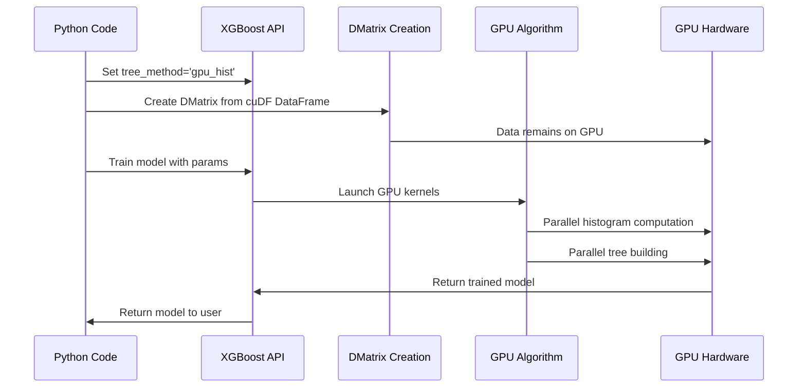

# Chapter 7: XGBoost GPU Integration

In [Chapter 6: cuML – GPU-Accelerated Machine Learning](06_cuml__gpu_accelerated_machine_learning_.md), you learned how to use GPU-powered machine learning algorithms with familiar scikit-learn-like syntax. Now, let's explore how to supercharge one of the most powerful machine learning algorithms out there – XGBoost – with GPU acceleration.

## Why Use GPU-Accelerated XGBoost?

Imagine you need to build a highly accurate predictive model for a complex problem, like predicting disease risk. You have lots of data and want the most accurate results, but traditional algorithms are taking too long to train.

**Central Use Case:**  
You need to predict infection probability for tens of thousands of patients across multiple features (age, location, symptoms). Your CPU-based model takes hours to train, but you need results in minutes for timely decision-making.

XGBoost on GPUs solves this problem by dramatically speeding up model training and prediction – often providing 10-50× faster performance compared to CPU-only training[1][4][5]. It's like upgrading from a regular car to a rocket ship – you'll reach your destination much faster, especially with large datasets.

## What is XGBoost?

Before diving into GPU acceleration, let's understand what XGBoost is:

XGBoost (eXtreme Gradient Boosting) is a powerful machine learning algorithm that builds a strong predictive model by combining many simple decision trees. Think of it as assembling a team of average experts who, when working together, become extraordinarily accurate.

Key strengths of XGBoost include:
- Excellent predictive accuracy
- Handling of missing values
- Regularization to prevent overfitting
- Speed and scalability

## Getting Started with GPU-Accelerated XGBoost

Using XGBoost on GPUs is surprisingly simple! Here's how to get started:

### Step 1: Import and Check Version

```python
import xgboost as xgb

# Check XGBoost version (need 1.0+ for best GPU support)
print('XGBoost version:', xgb.__version__)
```

Make sure you have XGBoost version 1.0 or later for the best GPU support and direct integration with cuDF DataFrames[3].

### Step 2: Prepare Your Data

You can use XGBoost with cuDF DataFrames directly, which means your data stays on the GPU throughout the process:

```python
import cudf
from cuml.preprocessing.model_selection import train_test_split

# Load data
gdf = cudf.read_csv('population_data.csv')

# Split into features and target
X = gdf[['age', 'sex', 'northing', 'easting']]
y = gdf['infected']

# Create training and testing sets
X_train, X_test, y_train, y_test = train_test_split(X, y, test_size=0.2)
```

This code loads your data, selects features, and splits it into training and testing sets – all while keeping everything on the GPU.

### Step 3: Configure XGBoost for GPU

The key to GPU acceleration is setting the `tree_method` parameter to `gpu_hist`[1][3][5]:

```python
# Define parameters for GPU-accelerated training
params = {
    'max_depth': 8,
    'tree_method': 'gpu_hist',  # This is the magic line that enables GPU acceleration!
    'objective': 'binary:logistic',  # For binary classification with probabilities
    'eval_metric': 'logloss'
}
```

The `gpu_hist` option tells XGBoost to use GPU-accelerated histogram computation, which is what makes training so much faster[1][3].

### Step 4: Create DMatrix and Train the Model

XGBoost uses a special data structure called DMatrix for efficient training:

```python
# Create DMatrix objects (XGBoost's optimized data structure)
dtrain = xgb.DMatrix(X_train, y_train)
dtest = xgb.DMatrix(X_test, y_test)

# Train the model
%time model = xgb.train(params, dtrain, num_boost_round=100)
```

The `%time` magic (if you're in Jupyter) shows you how long training takes – with GPU acceleration, you'll see impressive speeds even with complex models and large datasets[3][4][5].

### Step 5: Make Predictions

Once your model is trained, making predictions is straightforward:

```python
# Create DMatrix for test data
dtest = xgb.DMatrix(X_test)

# Make predictions
%time predictions = model.predict(dtest)

# First few predictions (probabilities between 0-1)
print(predictions[:5])
```

With GPU acceleration, you can make predictions on thousands of samples in milliseconds[3][5].

## Visualizing and Evaluating Your Model

XGBoost includes built-in visualization tools to help you understand your model:

```python
import matplotlib.pyplot as plt

# Plot feature importance
xgb.plot_importance(model, height=0.8)
plt.title('Feature Importance')
plt.grid(False)
plt.show()

# View an individual tree in the model
xgb.plot_tree(model, num_trees=0)
plt.figure(figsize=(20, 10))
plt.show()
```

These visualizations help you understand which features drive your predictions and how the decision trees are structured.

You can also evaluate model performance using standard metrics:

```python
import numpy as np
from sklearn.metrics import roc_curve, auc

# Convert GPU array to CPU for plotting
y_test_cpu = np.array(y_test.to_pandas())
y_pred = model.predict(xgb.DMatrix(X_test))

# Calculate ROC curve and AUC
fpr, tpr, _ = roc_curve(y_test_cpu, y_pred)
roc_auc = auc(fpr, tpr)

# Plot ROC curve
plt.figure()
plt.plot(fpr, tpr, label=f'AUC = {roc_auc:.3f}')
plt.plot([0, 1], [0, 1], 'k--')
plt.xlabel('False Positive Rate')
plt.ylabel('True Positive Rate')
plt.title('ROC Curve')
plt.legend(loc='lower right')
plt.show()
```

This code creates a ROC curve to help you visualize how well your model separates positive and negative cases.

## How XGBoost GPU Acceleration Works Under the Hood

When you run XGBoost with GPU acceleration, here's what happens behind the scenes:



The `gpu_hist` algorithm works by:

1. Computing histograms of features in parallel on the GPU
2. Finding optimal splits for decision trees using these histograms
3. Building multiple trees simultaneously using thousands of GPU cores
4. Keeping data on the GPU throughout the process to avoid slow data transfers

This parallelization is why GPU-accelerated XGBoost can be 10-50× faster than CPU-based training[1][3][4][5].

## XGBoost & Multi-GPU Training

For truly massive datasets, you can even scale XGBoost across multiple GPUs:

```python
# Enable multi-GPU training with Dask
import dask_cudf
from dask_cuda import LocalCUDACluster
from dask.distributed import Client

# Start a local CUDA cluster (one worker per GPU)
cluster = LocalCUDACluster()
client = Client(cluster)

# Load data with Dask-cuDF
ddf = dask_cudf.read_csv('massive_dataset.csv')
X = ddf[['feature1', 'feature2', 'feature3']]
y = ddf['target']

# Multi-GPU XGBoost parameters
params = {
    'tree_method': 'gpu_hist',
    'objective': 'binary:logistic'
}

# Train on multiple GPUs
dtrain = xgb.dask.DaskDMatrix(client, X, y)
output = xgb.dask.train(client, params, dtrain, num_boost_round=100)
model = output['booster']
```

This approach combines XGBoost GPU acceleration with [Dask-cuDF for Multi-GPU Processing](03_dask_cudf_for_multi_gpu_processing_.md), allowing you to handle enormous datasets efficiently.

## CPU vs. GPU Performance Comparison

To appreciate the speed difference, here's a simple comparison:

```python
# GPU training
params_gpu = {'tree_method': 'gpu_hist', 'objective': 'binary:logistic'}
%time model_gpu = xgb.train(params_gpu, dtrain, num_boost_round=100)

# CPU training (same parameters, different tree method)
params_cpu = {'tree_method': 'hist', 'objective': 'binary:logistic'}
dtrain_cpu = xgb.DMatrix(X_train.to_pandas(), y_train.to_pandas())
%time model_cpu = xgb.train(params_cpu, dtrain_cpu, num_boost_round=100)
```

On large datasets, you'll typically see the GPU version complete in seconds or minutes, while the CPU version might take minutes or hours[3][5].

## Tips for Maximizing GPU XGBoost Performance

1. **Use `gpu_hist` tree method**: This is the fastest GPU algorithm for XGBoost[1][3].

2. **Keep data on the GPU**: Use cuDF DataFrames and convert directly to DMatrix to avoid CPU-GPU transfers[3].

3. **Adjust your batch size**: For very large datasets, you may need to adjust the `gpu_batch_nrows` parameter.

4. **Monitor GPU memory**: Use `nvidia-smi` to check GPU memory usage during training.

5. **Experiment with depth**: GPU-accelerated XGBoost can efficiently handle deeper trees than CPU versions.

## Summary and What's Next

In this chapter, you've learned:

- How to accelerate XGBoost using GPUs with minimal code changes
- The basics of configuring XGBoost for optimal GPU performance
- How to visualize and evaluate your GPU-accelerated models
- The inner workings of GPU-accelerated tree building
- Techniques for scaling to multiple GPUs with Dask

GPU-accelerated XGBoost gives you the best of both worlds: the high accuracy of gradient boosting combined with the blazing speed of GPU computation. This means you can train more complex models, use larger datasets, and iterate faster – all leading to better predictive performance for your applications.

Now that you've mastered GPU-accelerated machine learning with both [cuML](06_cuml__gpu_accelerated_machine_learning_.md) and XGBoost, it's time to explore how to analyze relationships between data points using [cuGraph for GPU-Accelerated Graph Analytics](08_cugraph_for_gpu_accelerated_graph_analytics_.md).

---

Generated by [Erwin R. Pasia](https://github.com/erwinpasia/Full-Stack-Data-Science)
