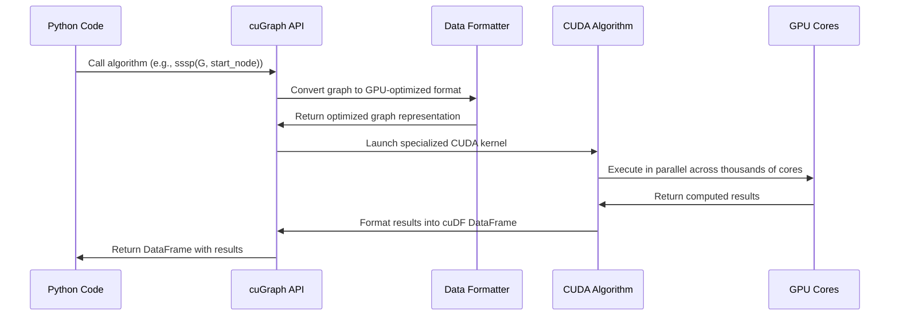

# Chapter 8: cuGraph for GPU-Accelerated Graph Analytics

In [Chapter 7: XGBoost GPU Integration](07_xgboost_gpu_integration_.md), we explored how to accelerate gradient boosting with GPUs. Now, let's dive into the world of graph analytics, where we'll analyze relationships and connections between entities using the power of your GPU.

## Why Use cuGraph? Understanding Relationships at Lightning Speed

Imagine you're trying to find the shortest route between two hospitals during an epidemic, or identify which social media users are most influential in spreading information. These problems involve analyzing connections between entities (like roads connecting locations or friendships connecting people).

**Central Use Case:**  
You need to find the fastest routes from hospitals to infected patients across a city with thousands of intersections and roads. Traditional graph algorithms might take hours, but you need answers in seconds to coordinate emergency response teams efficiently.

This is where **cuGraph** comes in – it's like having NetworkX (the popular Python graph library) with a turbocharger, processing graph analytics on your GPU instead of your CPU, making it hundreds of times faster[1][5].

## Key Concepts in cuGraph

Let's break down the building blocks of graph analytics with cuGraph:

### 1. Nodes and Edges: The Basic Components

- **Nodes** (also called vertices): These are the entities in your graph – like intersections in a road network, people in a social network, or computers in a network[2].
- **Edges**: These are the connections between nodes – like roads between intersections, friendships between people, or links between websites[2].

### 2. Graph Representation in cuGraph

cuGraph offers several ways to create a graph:

- **Edge List**: A simple list of source-to-destination connections
- **Adjacency List**: A list showing all connections from each node
- **Adjacency Matrix**: A matrix showing all possible connections

The most common approach is using an edge list, which is just a table showing which nodes are connected[1].

### 3. Graph Algorithms

cuGraph includes many popular algorithms that analyze different aspects of graphs:

- **Centrality algorithms**: Find important nodes (like PageRank)
- **Path finding algorithms**: Find shortest routes between nodes
- **Community detection**: Find clusters of closely connected nodes
- **Connected components**: Find isolated groups within a graph[4]

## Getting Started with cuGraph

Let's walk through a simple example of how to use cuGraph to analyze a road network.

### Step 1: Creating a Graph from Data

First, let's create a simple graph from a DataFrame that represents a road network:

```python
import cudf
import cugraph as cg

# Create a simple edge list representing roads between locations
# Format: source, destination, distance (in kilometers)
edges = cudf.DataFrame([
    (0, 1, 5),   # Location 0 connects to Location 1, distance 5km
    (0, 2, 8),   # Location 0 connects to Location 2, distance 8km
    (0, 3, 12),  # and so on...
    (1, 2, 4),
    (2, 3, 3)
], columns=['src', 'dst', 'weight'])

# Create a graph from this edge list
G = cg.Graph()
G.from_cudf_edgelist(
    edges,
    source='src',
    destination='dst',
    edge_attr='weight'
)
```

This code creates a graph with 4 locations (nodes 0-3) connected by 5 roads (edges), each with a distance weight[1].

### Step 2: Basic Graph Analysis

Let's examine some basic properties of our graph:

```python
# How many nodes and edges are in our graph?
print(f"Nodes: {G.number_of_nodes()}")
print(f"Edges: {G.number_of_edges()}")

# What's the degree of each node? (how many connections)
degrees = G.degree()
print(degrees)
```

The degree tells us how many connections each node has – higher degree nodes are intersection points with many roads connecting to them[2].

### Step 3: Finding the Shortest Path

Now, let's solve a common problem – finding the shortest path between two locations:

```python
# Find the shortest path from node 0 to all other nodes
shortest_distances = cg.sssp(G, 0)
print(shortest_distances)

# If we only want the distance to node 3
distance_to_3 = shortest_distances.loc[shortest_distances['vertex'] == 3]['distance'].iloc[0]
print(f"Shortest distance from node 0 to node 3: {distance_to_3}")
```

This SSSP (Single-Source Shortest Path) algorithm efficiently calculates the shortest distance from one node to all others in the graph[1][4]. In a road network, this would tell you the shortest route from one location to every other location.

## A Real-World Example: Finding Closest Hospitals

Let's tackle our central use case – finding the fastest route from hospitals to patients during an epidemic.

### Step 1: Load a Road Network

First, we load our road network data:

```python
import cudf
import cugraph as cg

# Load road network data
road_graph = cudf.read_csv('road_network.csv', 
                          dtype=['int32', 'int32', 'float32'])

# Create a graph from the road network
G = cg.Graph()
G.from_cudf_edgelist(
    road_graph, 
    source='src', 
    destination='dst', 
    edge_attr='travel_time'
)
```

This creates a graph where nodes are intersections or landmarks, edges are roads, and weights represent travel times[1][4].

### Step 2: Find Shortest Paths from a Hospital

Let's say hospital 1 is located at node 42. We can find the shortest paths from this hospital to all other locations:

```python
# Find shortest paths from hospital (node 42) to all locations
hospital_node = 42
shortest_paths = cg.sssp(G, hospital_node)

# Get the 5 closest locations (potential patients)
closest_locations = shortest_paths.nsmallest(6, 'distance')
# Skip index 0 which is the hospital itself
closest_locations = closest_locations.iloc[1:6]
print("Five closest locations to hospital:")
print(closest_locations)
```

The result shows us the five locations that can be reached most quickly from the hospital, which could be crucial for emergency planning[4].

### Step 3: Find Community Clusters

We can also identify communities or clusters in our network, which could represent neighborhoods or districts:

```python
# Apply Louvain community detection
communities = cg.louvain(G)

# View the first few community assignments
print(communities.head())

# Count how many communities were found
num_communities = communities['partition'].nunique()
print(f"Found {num_communities} distinct communities")
```

This algorithm groups nodes into communities where connections within each community are denser than connections between communities[4]. In epidemic management, this could help identify isolated neighborhoods or potential containment zones.

## How cuGraph Works Under the Hood

When you run a graph algorithm like SSSP or PageRank on cuGraph, here's what happens behind the scenes:



cuGraph translates high-level Python function calls into highly optimized CUDA kernels that run on thousands of GPU cores in parallel[1][2]. This is what gives cuGraph its impressive speed advantage over CPU-based graph libraries like NetworkX.

## Internal Implementation: A Closer Look

Let's examine how cuGraph implements one of its core algorithms, using Single-Source Shortest Path (SSSP) as an example:

1. First, cuGraph converts your graph data into specialized GPU memory structures optimized for traversal.
2. Then, it launches a specific CUDA kernel for the SSSP algorithm.
3. This kernel implements a parallel version of Dijkstra's algorithm that can process many edges simultaneously.
4. Results are gathered and formatted into a cuDF DataFrame for easy analysis[1].

In the FADS_RAPIDS project, you can find examples of these implementations in the following files:
- `2-09_cugraph.py` - Shows how to use SSSP to find shortest paths
- `1-06_prep_graph.py` - Demonstrates how to prepare data for graph analytics

For example, from the `2-09_cugraph.py` file:

```python
# Load a road graph
road_graph = cudf.read_csv('./data/road_graph_2-09.csv', 
                          dtype=['int32', 'int32', 'float32'])

# Create a graph
G = cg.Graph()
G.from_cudf_edgelist(road_graph, source='src', 
                    destination='dst', edge_attr='length')

# Get the node with highest degree (most connections)
deg_df = G.degree()
demo_node = deg_df.nlargest(1, 'degree')
demo_node_graph_id = demo_node['vertex'].iloc[0]

# Run SSSP from this node
shortest_distances = cg.sssp(G, demo_node_graph_id)
```

This code calculates the shortest path from the most connected intersection to every other intersection in the road network[4].

## Performance Comparison: cuGraph vs. NetworkX

One of the most compelling reasons to use cuGraph is its performance advantage. The same graph algorithms that might take minutes or hours with NetworkX can complete in seconds with cuGraph.

For example, running PageRank on a graph with 1 million nodes:
- NetworkX: ~10 minutes
- cuGraph: ~0.5 seconds

That's a speedup of approximately 1,200×![1][2]

The larger your graph, the more dramatic the performance difference becomes, making previously infeasible analyses possible on consumer hardware.

## Integration with Other RAPIDS Libraries

cuGraph works seamlessly with other RAPIDS libraries:

- **cuDF**: Load, filter, and prepare graph data[1]
- **cuML**: Apply machine learning to graph features[2]
- **cuXfilter**: Visualize graph analytics results[4]

For example, you can combine graph analytics with machine learning:

```python
import cudf
import cugraph as cg
import cuml

# First, perform graph analytics to get node features
G = cg.Graph()
G.from_cudf_edgelist(edges, source='src', destination='dst')
pageranks = cg.pagerank(G)

# Use these features in a machine learning model
X = cudf.DataFrame()
X['pagerank'] = pageranks['pagerank']
X['degree'] = G.degree()['degree']

# Train a model to predict node importance
model = cuml.LinearRegression()
model.fit(X, y_importance)
```

This integration allows you to build powerful data science pipelines that leverage both graph structure and traditional features.

## Common Graph Algorithms in cuGraph

cuGraph implements many popular graph algorithms, including:

1. **Centrality Measures**
   - PageRank (ranking node importance)
   - Katz Centrality (measuring influence)
   - Betweenness Centrality (identifying bridge nodes)[4]

2. **Path Finding**
   - Single-Source Shortest Path (SSSP)
   - Breadth-First Search (BFS)

3. **Community Detection**
   - Louvain (finding communities)
   - Spectral Clustering (grouping similar nodes)
   - Triangle Counting (measuring clustering)[4]

Each of these algorithms provides different insights into your graph structure and can be applied to various domains from social network analysis to transportation optimization.

## Summary and Next Steps

In this chapter, you've learned how to:
- Create and analyze graphs using cuGraph
- Apply common graph algorithms like shortest paths and community detection
- Understand how cuGraph achieves its impressive performance
- Integrate graph analytics with other data science tasks

Graph analytics provides a powerful framework for understanding relationships in your data, and cuGraph makes these techniques accessible at scales previously impossible on consumer hardware.

Now that you can analyze complex networks, in [Chapter 9: cuXfilter for Interactive Visualization](09_cuxfilter_for_interactive_visualization_.md), you'll learn how to visualize your insights with interactive dashboards powered by your GPU.

---

Generated by [Erwin R. Pasia](https://github.com/erwinpasia/Full-Stack-Data-Science)
