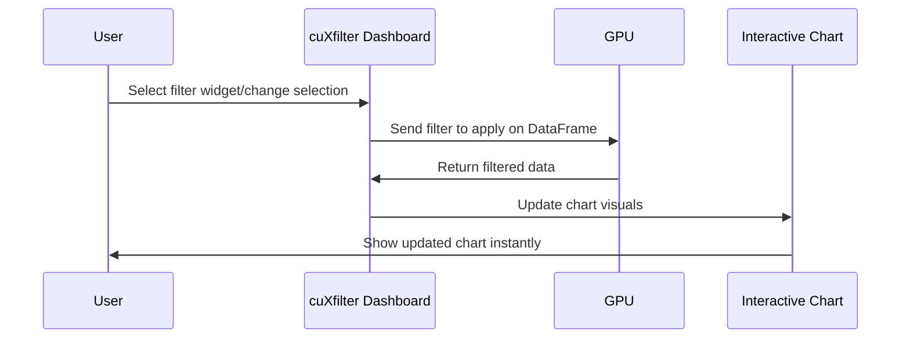

# Chapter 9: cuXfilter for Interactive Visualization

In the last chapter, you learned how to analyze complex relationships between data points using [cuGraph for GPU-Accelerated Graph Analytics](08_cugraph_for_gpu_accelerated_graph_analytics_.md). Now, let's make all that analysis *come alive* with interactive dashboards—powered by **cuXfilter**.

## Why cuXfilter? Instantly Exploring Big Data — Visually

**Central Use Case:**  
Imagine you have millions of records representing people, locations, or events. You want to *see* patterns: Where are population clusters? How are infection cases distributed? Which counties stand out? With traditional visualization tools, massive datasets bring things to a crawl.

**cuXfilter** lets you interactively filter and explore huge, GPU-accelerated datasets—think Tableau or PowerBI, but designed to stay lightning-fast with millions of points. Change a selection, and every chart updates instantly, even with gigantic data.

## What Is cuXfilter?

*cuXfilter* is a Python library that lets you create interactive dashboards—right inside a Jupyter notebook—with just a few lines of code. It connects your RAPIDS data (from cuDF or Dask-cuDF) to GPU-accelerated plots and filter widgets, enabling instant exploration of your largest datasets[1][2][3][5].

**Analogy:**  
cuXfilter is like a control panel for your data: twist a dial (select a widget) and instantly see the result across multiple charts—no waiting, no lag.

---

## Key Concepts: How cuXfilter Works (Simply!)

- **Data Source:** Always a cuDF or Dask-cuDF DataFrame (from previous chapters) that lives on your GPU.
- **Charts:** Visual representations (scatterplots, bar charts, etc.)—all GPU-accelerated.
- **Widgets:** Interactive controls (dropdowns, sliders) that let you filter the data.
- **Dashboard:** The interactive web page where all your charts and widgets live together, auto-updating in sync[2][3].

With cuXfilter, *every widget and chart is instantly linked*: change one, and everything updates—powered by the GPU.

---

## Solving the Use Case: Visualizing Population Density

Let's walk through a real-world use case—exploring population density—and build a dashboard step by step.

### Step 1: Load Data with cuDF

We'll start by loading population data (already transformed to grid coordinates in earlier chapters):

```python
import cudf

gdf = cudf.read_csv('./data/pop_2-02.csv', usecols=['easting', 'northing', 'county'])
```
*This brings our GPU-powered DataFrame into Python. Columns are `easting`, `northing`, and `county`.*

---

### Step 2: Prepare the Data

cuXfilter widgets often work best with integer columns (not strings). Let's convert the county names into integer codes:

```python
gdf['county'], county_names = gdf['county'].factorize()
county_map = dict(zip(list(county_names.index.to_arrow()), county_names.to_arrow()))
```
*Now, the `county` column is integers, and `county_map` lets cuXfilter display readable county names in widgets.*

---

### Step 3: Associate Data with cuXfilter

Connect your DataFrame to cuXfilter:

```python
import cuxfilter as cxf

cxf_data = cxf.DataFrame.from_dataframe(gdf)
```
*This step tells cuXfilter what data it should visualize and filter.*

---

### Step 4: Define Charts and Widgets

Let's make a scatterplot showing population locations, and a widget to filter by county:

```python
# Set up chart size
chart_width = 600
scatter_chart = cxf.charts.datashader.scatter(
    x='easting', y='northing',
    width=chart_width,
    height=int((gdf['northing'].max() - gdf['northing'].min()) /
               (gdf['easting'].max() - gdf['easting'].min()) * chart_width)
)

# County filter widget
county_widget = cxf.charts.panel_widgets.multi_select('county', label_map=county_map)
```
*Here, `scatter_chart` displays all people as points; `county_widget` lets you select one or more counties to filter the data.*

---

### Step 5: Create and Show the Dashboard

Combine charts and widgets into a dashboard:

```python
dash = cxf_data.dashboard([scatter_chart, county_widget], theme=cxf.themes.dark, data_size_widget=True)
```
*Now you have a fully interactive dashboard!*

To preview a chart non-interactively:

```python
scatter_chart.view()
```
*You'll see a static chart right in your notebook—easy for a quick look.*

To launch the *full* interactive dashboard (in practice, you set `my_url` to your notebook’s address):

```python
my_url = 'http://your-host-url'
dash.show(my_url, port=8789)
```
*Open the generated link and interact: select a county, and see all the charts update instantly, even with millions of rows!*

---

### Example Inputs and Outputs

**Input:**  
- *Data:* Millions of rows with `easting`, `northing`, and `county`
- *Your action:* Select a specific county using the widget

**Output:**  
- The scatterplot instantly zooms to show only the data from the selected county.  
- The dashboard updates live as you filter.

---

## How Does cuXfilter Work Under the Hood?

Here's what happens when you interact with a cuXfilter dashboard:


*Your action triggers fast filtering on the GPU, with updated charts displayed immediately.*

---

## cuXfilter in Action: Code References

You can find these workflows in the project notebooks:

- `2-02_population_viz.py`: Visualizing the UK population with dashboards and filtering by county.
- `2-03_k-means.py`, `2-04_DBSCAN.py`: Visualizing clustering algorithm outputs (K-Means, DBSCAN) with interactive dashboards and cluster selection.

**Example: Visualizing K-Means Clusters**

```python
import cuxfilter as cxf

# After running K-Means clustering and adding 'cluster' column to gdf
cxf_data = cxf.DataFrame.from_dataframe(gdf)
scatter_chart = cxf.charts.datashader.scatter(x='easting', y='northing', width=600, height=800)
cluster_widget = cxf.charts.panel_widgets.multi_select('cluster')

dash = cxf_data.dashboard([scatter_chart, cluster_widget], theme=cxf.themes.dark, data_size_widget=True)
```
*Now, selecting a cluster in the widget instantly highlights its members in the scatterplot, even with huge datasets.*

---

## cuXfilter's Architecture (Quick Overview)

- Built to connect your notebook (Python) to high-performance GPU filtering (cuDF) and powerful visualization backends (DataShader, Bokeh, Panel)[2][3][5].
- Every change to a widget or chart sends a filter to the GPU, which cross-filters the data and returns updates for all linked charts, streamed back to your browser in real time.

---

## Summary

In this chapter, you learned:

- **cuXfilter** enables instant, interactive dashboards for huge GPU-accelerated datasets.
- With a few lines of code, you can connect RAPIDS DataFrames to scatterplots, bar charts, and widgets that update live as you explore.
- The GPU ensures your dashboards stay responsive, even with millions of rows.
- Internally, cuXfilter orchestrates seamless connections between your data, filtering logic, and fast visualizations.

Ready to put all your GPU-powered analytics together into live, interactive dashboards? In the next chapter, you’ll see how to go from insight to impact with RAPIDS visualization tools.

Continue to [Next Chapter]().

---

Generated by [Erwin R. Pasia](https://github.com/erwinpasia/Full-Stack-Data-Science)
