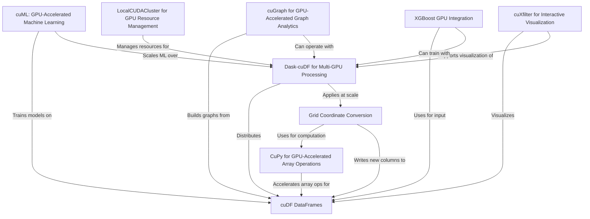

# Tutorial: The_FADS_RAPIDS

**The_FADS_RAPIDS** project is a comprehensive, GPU-accelerated data science toolkit designed to make large-scale data analysis, machine learning, and visualization dramatically faster and more interactive.
By leveraging RAPIDS libraries—including GPU-powered DataFrames and arrays, distributed computing, geospatial tools, and real-time dashboards—it empowers users to analyze, cluster, model, and visualize huge datasets with *minimal code changes*, using familiar APIs similar to pandas and scikit-learn but supercharged for modern NVIDIA GPUs.

**Source Repository:** [None](None)

## Chapters

1. [cuDF DataFrames
](01_cudf_dataframes_.md)
2. [CuPy for GPU-Accelerated Array Operations
](02_cupy_for_gpu_accelerated_array_operations_.md)
3. [Dask-cuDF for Multi-GPU Processing
](03_dask_cudf_for_multi_gpu_processing_.md)
4. [LocalCUDACluster for GPU Resource Management
](04_localcudacluster_for_gpu_resource_management_.md)
5. [Grid Coordinate Conversion
](05_grid_coordinate_conversion_.md)
6. [cuML: GPU-Accelerated Machine Learning
](06_cuml__gpu_accelerated_machine_learning_.md)
7. [XGBoost GPU Integration
](07_xgboost_gpu_integration_.md)
8. [cuGraph for GPU-Accelerated Graph Analytics
](08_cugraph_for_gpu_accelerated_graph_analytics_.md)
9. [cuXfilter for Interactive Visualization
](09_cuxfilter_for_interactive_visualization_.md)

---

Generated by [Erwin R. Pasia](https://github.com/erwinpasia/Full-Stack-Data-Science)
